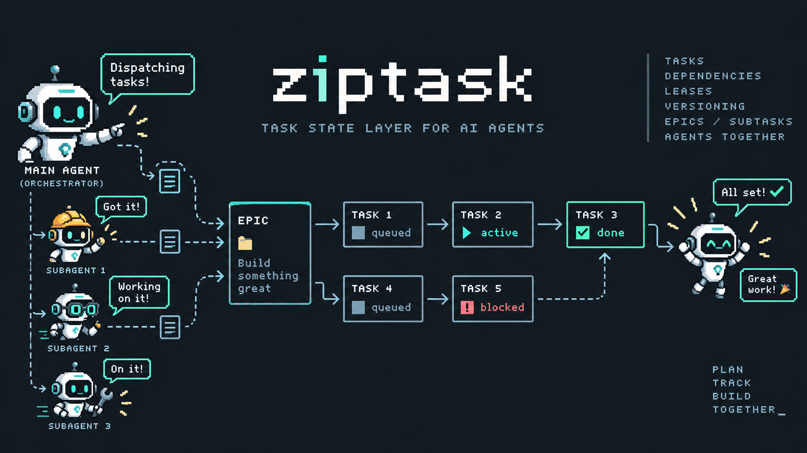

# ziptask

[](https://github.com/zumik3-del/ziptask/actions/workflows/ci.yml)
[](https://coveralls.io/github/zumik3-del/ziptask?branch=main)
[](https://github.com/zumik3-del/ziptask/releases)
[](LICENSE)
[](https://bun.sh)

MCP task tracker for AI agents — pure state layer (statuses, deps, leases, versioning) over SQLite.



## Install

One-liner — installs the published binary via the `deploy/` framework (see
[`deploy/app.env`](deploy/app.env) for every knob), seeds a default
`settings.json` and provisions the service:

```bash
# latest release
curl -fsSL https://raw.githubusercontent.com/zumik3-del/ziptask/main/deploy/install.sh | bash

# from a checkout, or pinned to a version
sudo bash deploy/install.sh --version v0.1.3
```

Canonical layout: binary in `/opt/ziptask`, database **and** `settings.json` in
`/var/lib/ziptask/`, deploy state (helpers, hooks, `app.env`) in `~/.ziptask/`.
Override with `--dir`, `--port`, `--version` and `--no-service`;
`bash deploy/install.sh --help` lists them all. `updater.sh` and
`uninstall.sh` are installed into `~/.ziptask/scripts/`.

The layout, the unit policy and the per-app `app.env` keys are shared with
synaptomind and subagentix and documented once, in
[zumik3-del/synaptomind `docs/DEPLOY-LAYOUT.md`](https://github.com/zumik3-del/synaptomind/blob/main/docs/DEPLOY-LAYOUT.md).

Prebuilt release binaries target Linux x86_64 only. On other platforms (macOS, arm64 Linux) build from source with `bun run build:bin`.

### Service mode

When systemd is detected and running, the installer renders
`/etc/systemd/system/ziptask.service` from the framework's unit template
(`Restart=always`, a bounded `TimeoutStopSec`, and the usual hardening) and
starts it. The unit runs as the user that invoked the installer — even under
`sudo`, `SUDO_USER` is honoured. Manage it with:

```bash
sudo systemctl start ziptask
sudo systemctl stop ziptask
sudo systemctl enable ziptask     # auto-start on boot
journalctl -u ziptask -f         # live logs
```

Remove with `bash ~/.ziptask/scripts/uninstall.sh`. It keeps the binary, the
database and the state directory by default; add `--purge` to delete them.

### MCP client config (stdio)

```jsonc
// Claude Desktop / Cursor / opencode — see your client's MCP config (key "mcpServers" in most)
{
  "mcpServers": {
    "ziptask": {
      "command": "/opt/ziptask/ziptask",
      "args": ["--stdio", "--settings", "/var/lib/ziptask/settings.json"]
    }
  }
}
```

Pass `--settings` so the DB path and options come from `settings.json` regardless of the client's working directory — otherwise the DB defaults to `./data/ziptask.db` under the client's cwd. Clients do not expand `~` in `command`/`args`; substitute the absolute path (the installer prints a ready-to-paste block).

### MCP client config (remote HTTP)

When the service is running on the same host, point the client at the HTTP endpoint instead:

```jsonc
{
  "mcp": {
    "ziptask": { "type": "remote", "url": "http://127.0.0.1:3005/mcp" }
  }
}
```

The endpoint has no authentication, so keep it bound to `127.0.0.1` (`ZIPTASK_HOST`/`settings.json`). Use a reverse proxy with auth if it must be reachable from other hosts.

## Quick start (from source)

Requires [Bun](https://bun.sh) ≥ 1.4.

```bash
bun install
bun run start          # HTTP server on an ephemeral port (MCP endpoint + /health + experimental /api/task/:id)
bun run start:stdio    # run over stdio
```

## Build a binary

```bash
bun run build:bin        # produces dist/ziptask
dist/ziptask --version   # prints ziptask and the package.json version
dist/ziptask --stdio     # runs as stdio MCP server
```

## Architecture

Layered by carrier, no framework beyond the MCP SDK:

| Layer | Location | Responsibility |
|---|---|---|
| MCP | `src/mcp/` | Tool schemas, registration, response shaping |
| Service | `src/core/` | Domain rules: transitions, leases, deps, versioning |
| Storage | `src/db/` | SQL (bun:sqlite, WAL) + migrations |
| Entry | `src/index.ts`, `src/server.ts` | Composition root, HTTP transport |

The public task API is MCP, exposed at `POST`/`GET`/`DELETE` `/mcp`, alongside `GET /health` and one experimental REST-style read endpoint, `GET /api/task/:id`, kept as an integration endpoint for the subagentix client. No endpoint authenticates. See [HTTP endpoints](docs/http-endpoints.md).

## Development

```bash
bun test               # unit tests (per-test temp DBs)
bunx tsc --noEmit      # type check
bunx biome check src/  # lint
bun run src/smoke.ts   # MCP end-to-end over HTTP (ephemeral port + temp DB)
bun run changelog      # rebuild CHANGELOG.md from git tags (maintainers; clean tree required, then commits and pushes it)
```

## Documentation

- [Configuration](docs/configuration.md) — `settings.json`, environment variables, the upgrade path, and backups.
- [HTTP endpoints](docs/http-endpoints.md) — `/mcp`, `/health`, and the experimental `GET /api/task/:id` integration endpoint.
- [MCP tools](docs/mcp-tools.md) — tool reference, task statuses, lease-reap semantics, and lease recovery paths.
- [Epic → sub-task workflow](docs/epics.md) — declaring epics, attaching sub-tasks, roll-up and closure.
- [Subagent setup](docs/subagents.md) — install and configure the example orchestrator + subagent agents.

## License

MIT

Please note that this project is released with a [Contributor Code of Conduct](CODE_OF_CONDUCT.md). By participating in this project you agree to abide by its terms.
